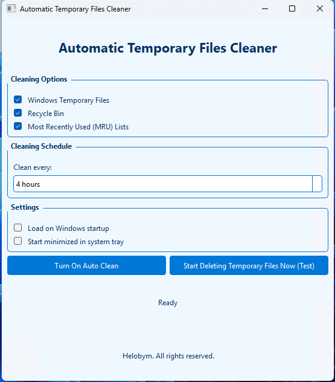
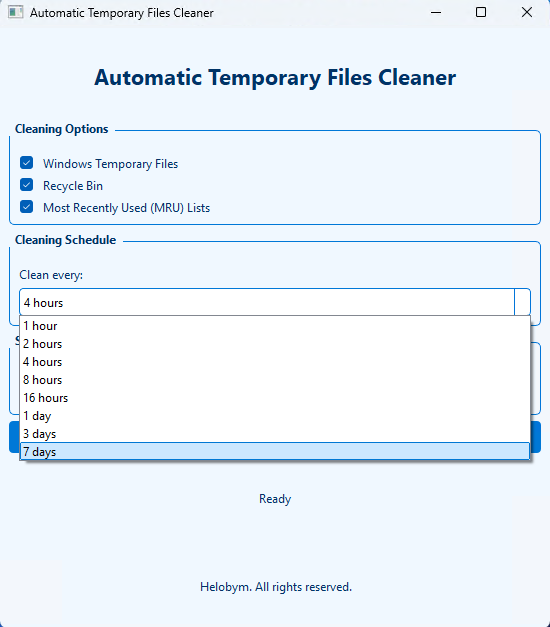

This software is developed by [Helobym](https://helobym.com)

The application offers scheduled cleaning on configurable intervals (1 hour to 7 days), can clean Windows temporary files, the Recycle Bin, and MRU (Most Recently Used) lists.

[Demo Video](https://youtu.be/jAR9RXnB36Q)

